# High-Performance RTSP/RTP Video Streaming System

[](https://www.python.org/)
[](#architecture)
[](https://hcmus.edu.vn/)

Real-time video streaming pipeline built from scratch in Python, utilizing **RTSP** (Real-Time Streaming Protocol) for control signaling, **RTP** (Real-Time Transport Protocol) for packetized media transmission, and **I/O Multiplexing** for scalable concurrent connections. 

Designed and implemented as a professional university project for the **Computer Networks** course at **Ho Chi Minh City University of Science (HCMUS)**.

---

## 🌟 Key Features

*   **⚡ Non-Blocking Multiplexed Server:** Built with the Python `selectors` module to implement I/O multiplexing. The server manages multiple client RTSP signaling channels concurrently on a single thread without blocking, ensuring optimal resource utilization.
*   **🔄 Hybrid Dual-Transport Architecture (UDP & TCP):**
    *   **SD (Standard Definition) Streaming:** Streamed over **UDP** for low-overhead, real-time packet delivery.
    *   **HD (High Definition) Streaming:** Streamed over **TCP** with custom length-prefixed framing (5-byte headers) to ensure 100% reliable packet reassembly and eliminate packet-loss artifacts in high-bitrate media.
*   **📶 Client-Side Jitter Buffer (Double-Buffered State Machine):**
    *   Implements a thread-safe, lock-protected queue that acts as a client caching layer.
    *   Utilizes a **Low-Water / High-Water Mark state machine** (`minBufferSize = 15` frames) to dynamically pause/resume visual rendering, absorbing network jitter and packet arrival fluctuations.
*   **🎬 Seamless Dynamic Quality Switching:** Clients can switch stream resolutions on-the-fly. The client triggers a pipeline draining phase that safely plays out cached buffer frames before establishing a new RTP session, preserving session state and preventing UI flickering.
*   **📦 UDP Fragmentation & RTP Reassembly:** Features robust fragmentation for UDP payloads exceeding MTU limits (1400 bytes). Employs RTP Marker bits to detect frame boundaries, facilitating perfect client-side JPEG reassembly.
*   **🎨 Premium Responsive Tkinter GUI:** A dark-themed, sleek user interface displaying live video playback, buffer state visualizations, and intuitive playback controls (Setup, Play, Pause, Quality Selection, and Teardown).

---

## 📐 System Architecture

The application separates control messaging and media delivery channels, maintaining clean state machine transitions at both client and server nodes:

```mermaid
sequenceDiagram
    autonumber
    actor User
    participant Client as RTP/RTSP Client
    participant Server as Multiplexed RTSP Server

    User->>Client: Clicks "Setup" & Selects Quality (SD/HD)
    Client->>Server: RTSP SETUP (Transport: UDP/TCP)
    Server-->>Client: RTSP 200 OK (Session ID, Server Ports)
    
    User->>Client: Clicks "Play"
    Client->>Server: RTSP PLAY
    Server-->>Client: RTSP 200 OK
    Note over Server, Client: RTP Media Channel Activated
    
    rect rgb(20, 20, 30)
        Note over Server, Client: Media Streaming Loop
        Server->>Server: Read MJPEG Frame
        alt Quality == SD (UDP)
            Server->>Server: Fragment Frame (MTU = 1400 bytes)
            Server->>Client: Send RTP Packets over UDP
        else Quality == HD (TCP)
            Server->>Client: Send RTP Packet over TCP (5-byte length-prefix)
        end
        Client->>Client: Reassemble & Queue in Jitter Buffer
        Client->>Client: Render from Buffer (Min Buffer: 15 frames)
    end

    User->>Client: Clicks "Setup" (Switch Quality)
    Note over Client: Enters isDraining Pipeline Mode
    Note over Client: Plays out cached frames to avoid abrupt cut
    Client->>Server: RTSP SETUP (New Quality Selected)
    Server->>Server: Close Old RTP Channel & Re-initialize Video Stream
    Server-->>Client: RTSP 200 OK
    Client->>Server: RTSP PLAY
    Server-->>Client: RTSP 200 OK
    Note over Server, Client: New RTP Media Channel Starts
```



---

## 🛠️ State Machine

The client state engine integrates network operations and buffer rendering transitions seamlessly:

```
                  +--------------------------------+
                  |              INIT              |
                  +--------------------------------+
                                  |
                                  | SETUP (Selects SD/HD)
                                  v
                  +--------------------------------+
                  |             READY              |
                  +--------------------------------+
                    ^                            |
    TEARDOWN / Reset |                            | PLAY
                     |                            v
                  +--------------------------------+
                  |            PLAYING             |
                  +--------------------------------+
                    |                            ^
                    | PAUSE                      | PLAY
                    v                            |
                  +--------------------------------+
                  |        PAUSED (READY)          |
                  +--------------------------------+
```

---

## 🚀 Quick Start

### 📋 Prerequisites
*   Python 3.8+
*   `Pillow` (PIL) library for GUI image rendering
*   Tkinter support installed on your system (e.g., `sudo apt-get install python3-tk` on Ubuntu/Debian)

### 📥 Installation & Setup
1. Clone the repository:
   ```bash
   git clone https://github.com/<your-username>/python_rtp.git
   cd python_rtp
   ```
2. Create and activate a virtual environment:
   ```bash
   python -m venv venv
   source venv/bin/activate  # On Windows use: venv\Scripts\activate
   ```
3. Install dependencies:
   ```bash
   pip install Pillow
   ```

### 💻 Running the Application

1. **Start the Multi-Client RTSP Server:**
   ```bash
   python Server.py <server_port>
   
   # Example:
   python Server.py 8554
   ```
2. **Launch the Video Client:**
   ```bash
   python ClientLauncher.py <server_ip> <server_port> <rtp_port> <video_file>
   
   # Example (running client locally connecting to server):
   python ClientLauncher.py 127.0.0.1 8554 25000 movie.Mjpeg
   ```

---

## 📁 Repository Structure

```hl
.
├── Client.py             # RTSP Client core logic & Jitter Buffer controls
├── ClientLauncher.py     # GUI and Client initialization entry point
├── RtpPacket.py          # RTP Packet encapsulation & header parsing (12-byte headers)
├── Server.py             # Non-blocking I/O multiplexing RTSP Server entry point
├── ServerWorker.py       # RTSP State Machine, TCP/UDP Media Streamer, Frame Fragmenter
├── VideoStream.py        # MJPEG parser and frame extraction engine
├── movie.Mjpeg           # Sample MJPEG video file
├── doc/
│   ├── report_template.pdf  # Comprehensive system specification report
│   └── report_template.tex  # LaTeX source file of the report
└── README.md             # This documentation
```

---

## 👥 Authors

*   **Đặng Võ Hồng Phúc** - HCMUS
*   **Trịnh Chấn Duy** - HCMUS

---

## 📄 License
This project is developed for educational purposes under the Computer Networks curriculum at HCMUS. Feel free to use and build upon this code.
